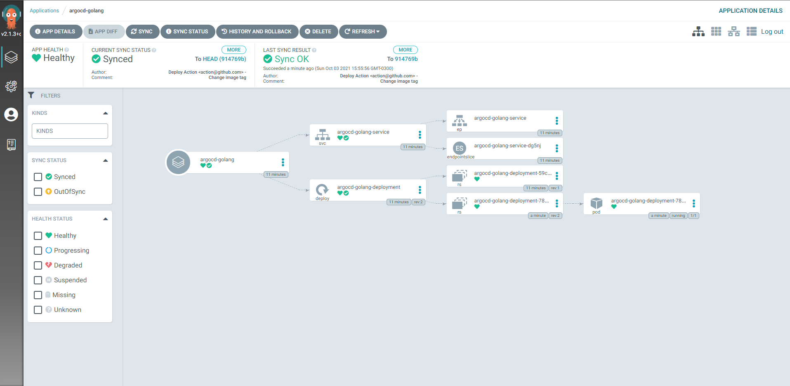
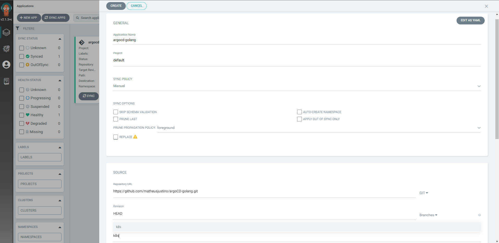

## DESCRIÇÃO

- Repositório para estudos de Kubernetes e Continuos Delivery com o Argo no Github.
- Argo doc.: https://argo-cd.readthedocs.io/en/stable/getting_started/

## Utilizando o Argo

- `kubectl create namespace argocd`
- `kubectl apply -n argocd -f https://raw.githubusercontent.com/argoproj/argo-cd/stable/manifests/install.yaml`
- Argo dashboard `kubectl port-forward svc/argocd-server -n argocd 8080:443`
- Argo password `kubectl -n argocd get secret argocd-initial-admin-secret -o jsonpath="{.data.password}"`, depois faça um decode base64
- Crie um namespace `kubectl create namespace argocd-golang`. O MongoDB deve estar rodando no mesmo namespace da api.
- Crie um App no Argo
- Sincronize o argo com o repositório git

## LIBS

- LOAD ENVS: go get github.com/joho/godotenv
- GIN: go get github.com/gin-gonic/gin
- GORM: go get gorm.io/gorm
- MONGODB: go get go.mongodb.org/mongo-driver/mongo

## ARGO

- ### ARGOCD-GOLANG APP

  

- ### CRIANDO E SINCRONIZANDO O APP COM O REPOSITÓRIO GIT
  
